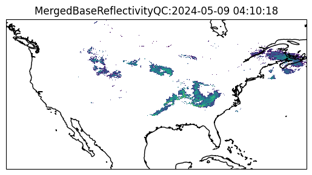

# mrms.py

Lightweight simple API to live Multi-Radar/Multi-Sensor (MRMS) data to handle data retrieval,
unzipping the data, and reading the data from grib2 into an ``Array`` which is just a subclassed
``numpy.ndarray`` with some additional metadata.

```python
import numpy as np
import matplotlib.pyplot as plt
import cartopy.crs as ccrs
import mrms

fig, ax = plt.subplots(subplot_kw={'projection': ccrs.PlateCarree()})
ax.coastlines()

arr = mrms.get(mrms.MERGED_BASE_REFLECTIVITY_QC)
arr[arr < 0] = np.nan

ax.pcolormesh(mrms.longitude, mrms.latitude, arr, transform=ccrs.PlateCarree())
ax.set_title(f"{arr.name}:{arr.datetime}");
```

